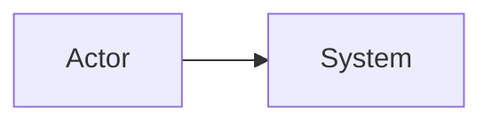

# Software architect skill (develop-architect)

## Purpose

Turn **stated requirements and constraints** into **coherent technical structure**: prioritized NFRs, **C4-aligned** diagrams (Mermaid), **typed** data models where required, explicit **trade-offs**, and **append-only ADRs** tied to the active contributor folder.

## When to Use

- Designing or documenting **systems**, **integrations**, **data architecture**, or **high-level solutions** for the LTI/ATS design exercise.
- Producing **`erDiagram`**, **context/container/component** views, or **sequence** diagrams that must reflect **trust boundaries** and **PII**.
- Recording **committed**, **rejected**, or **superseded** technical decisions in the **ADR log**.

## When Not to Use

- **Replacing** product strategy, MVP prioritization, or **problem framing** without PRD/**`ReadMe.md`**/user alignment → product owner / **generate-prd**.
- **Phased delivery planning** as the only artifact → **`ai-specs/plan/<NNN>-plan.md`** per **`.cursor/rules/40-naming-and-paths.mdc`** (no dedicated skill in this repo revision).
- **Single story** acceptance specs as the only artifact → **`ai-specs/tasks/<NNN>-task.md`** per **`.cursor/rules/40-naming-and-paths.mdc`** (no dedicated skill in this repo revision).
- **Git commits** only → **commit**.
- **Read-only audit** of multiple docs → **validate-artifacts** (may consume outputs of this skill).

## Inputs

- **Requirements source:** repository-root **`ReadMe.md`** (course brief; not **`README.md`** or **`.cursor/README.md`**), **`LTI-<CONTRIBUTOR-SLUG>/<NNN>-prd.md`**, **`LTI-<CONTRIBUTOR-SLUG>/LTI-<CONTRIBUTOR-SLUG>.md`**, or user-provided constraints.
- **Contributor slug** for ADR + deliverable paths: e.g. **`LTI-ICS`** (folder name = basename of main `.md`).
- Optional: existing **ADR** file **`LTI-<CONTRIBUTOR-SLUG>/ADR.md`**.

## Outputs

- **Architecture prose + Mermaid** in user-targeted files (often embedded in **`LTI-<CONTRIBUTOR-SLUG>/LTI-<CONTRIBUTOR-SLUG>.md`**).
- **ADR log** at:

```text
LTI-<CONTRIBUTOR-SLUG>/ADR.md
```

Example: slug **`LTI-ICS`** → **`LTI-ICS/ADR.md`** (repository root–relative).

- **Diagram types:** `flowchart` / `sequenceDiagram` / `erDiagram` per rules below.

## Process

### Mindset

- **Requirements first**: business outcomes, actors, constraints (regulatory, cost, latency, team, legacy).  
- **Explicit trade-offs**: every important choice costs something—state what was deprioritized.  
- **Diagrams + prose**: boxes without rationale are insufficient; walls of text without structure are hard to validate.

### Architectural drivers

1. Elicit and **prioritize quality attributes** (availability, consistency, scalability, security, operability, time-to-market).  
2. Map the **top two or three** to structural decisions (sync vs async, split vs monolith, where data lives, trust boundaries).  
3. List **assumptions** and **risks** (what would invalidate the design).

### Solution shaping

- **Decompose** by capability or bounded context; avoid naming components only after technologies.  
- **Integration**: choose sync API, async events, batch, or files intentionally—note latency, ordering, idempotency, failure behavior.  
- **Trust boundaries**: authN/authZ, sensitive data, external systems, admin vs tenant-facing paths.  
- **Operations**: deployability, observability (logs/metrics/traces), backups, rollbacks, secrets—at least at a high level.

### Clean architecture considerations

Apply when proposing **structure** inside an application boundary; adapt to monolith vs services.

| Principle | Practice |
|-----------|----------|
| **Understand the problem domain** | Name **bounded contexts**; align box names with **ubiquitous language**. |
| **Clear division of responsibilities** | **Domain** (rules, entities), **application** (use cases), **infrastructure** (DB, queues, HTTP clients), **presentation** (API/UI). |
| **DIP** | Inner layers define **ports**; outer layers **adapters**; dependencies point **inward**. |
| **Focus on the core** | Domain + use cases stay technology-agnostic in documentation. |
| **Unit vs integration testing** | Fast unit tests without real I/O; integration tests for adapters. |
| **Technological flexibility** | Swappable implementations behind ports. |
| **Scalability and maintainability** | Modular boundaries; document scaling assumptions. |

### Modeling (C4-aligned)

| Level | Answers | Typical audience |
|-------|---------|------------------|
| Context | System, users, external dependencies | Broad |
| Containers | Deployable units, major tech | Devs, ops |
| Components | Major parts inside one container | Devs |

**Hygiene:** one main idea per diagram; **consistent names** across levels; label **protocols** and **sync vs async**; short **legend** when needed. Prefer **Mermaid**; split oversized graphs.

### Mermaid-first rule

Produce architecture artifacts with fenced Mermaid blocks.

```markdown

```

- Prefer `flowchart`, `sequenceDiagram`, `erDiagram` as appropriate.  
- Pair each block with **2–5 lines** explaining purpose, flows, and trade-offs.

### Decisions (ADR-style)

For costly or contested choices: **Context**, **Decision**, **Options** (with pros/cons), **Consequences**. Mark superseded decisions instead of silent deletes.

### ADR log — `LTI-<CONTRIBUTOR-SLUG>/ADR.md` (required when decisions are recorded)

When this skill shapes the reply, **update** **`LTI-<CONTRIBUTOR-SLUG>/ADR.md`** in the **same turn** if the reply records **any** of:

- A **committed** architectural decision.  
- A **rejected** option worth preserving.  
- A **meaningful change** that **supersedes** a prior decision.

If the turn is **purely exploratory** (no decision, rejection, or supersession), **do not** append placeholders.

**File setup**

- Path: **`LTI-<CONTRIBUTOR-SLUG>/ADR.md`** (example: **`LTI-ICS/ADR.md`**).  
- Create folder and file if missing. New file starter:

```markdown
# Architecture decision records (ADR)

<!-- Numbered ADRs below; newest entries appended. -->

```

**Numbering and append rules**

1. Find highest **`ADR-NNN`** heading (`NNN` zero-padded three digits). Next entry **`ADR-<NNN+1>`**; if none, start **`ADR-001`**.  
2. **Append** new ADRs at **end** (preserve history).  
3. Separate consecutive ADRs with a line containing only **`---`** (not before the first).  
4. **Supersede:** add new ADR stating what it replaces; edit older block **only** to set **Status** to `Superseded by ADR-XXX`—**do not** delete prior text.

**Entry template (append each ADR)**

```markdown
## ADR-NNN — <short title>

**Status:** Proposed | Accepted | Superseded by ADR-XXX  
**Date:** <YYYY-MM-DD>  
**Context:**  
…

**Decision:**  
…

**Options considered:**  
- …

**Consequences:**  
…

```

Redact secrets and confidential identifiers.

### Alignment with `ReadMe.md` (LTI / AI4Devs)

When producing **`LTI-<CONTRIBUTOR-SLUG>/LTI-<CONTRIBUTOR-SLUG>.md`**, this skill **leads**:

| Course requirement | This skill delivers |
|--------------------|---------------------|
| **Data model** — entities, attributes (**name + type**), relationships | **`erDiagram`** (or tables + ER Mermaid) with types and cardinalities |
| **High-level system design** — prose + diagram | Context/container narrative + **Mermaid** |
| **C4** — depth on **one** component | Component diagram **inside** chosen container |
| **3 use cases** — technical diagrams | **Co-own** with PM: refine **sequence**/**flow** for auth, stores, externals |

**Lean Canvas**, **brief / competitive story**, and **first-pass** function list are **product-manager** / **generate-prd** territory—do not replace unless no PM content exists and the user requests a **minimal** placeholder.

## Quality Checks

| Check | Pass |
|-------|------|
| NFRs → structure | Top quality attributes reflected in diagrams/decomposition |
| Diagrams | Mermaid fences valid; names consistent across context/container/component |
| Trust & PII | Sensitive flows called out; boundaries plausible |
| ADRs | **`LTI-<CONTRIBUTOR-SLUG>/ADR.md`** updated when decisions/rejections/supersessions occurred this turn |
| Honesty | Open risks and unknowns visible; no fake precision on compliance |

**Bad output:** Technology laundry list with no requirement mapping; “scalable/secure” without criteria; duplicate C4 levels with no added detail.

**Good output:** Ranked NFRs, diagrams + short rationale, ADRs for contested choices, explicit assumptions.

## Create vs Update Guidance

| Artifact | Create | Update |
|----------|--------|--------|
| **ADR log** | Create **`LTI-<CONTRIBUTOR-SLUG>/ADR.md`** with header if missing | **Append** ADRs only; use **supersede** pattern—no silent deletion of history |
| **Deliverable `.md`** | Add new sections/diagrams where missing | **Read** existing file; **merge** diagrams and prose; avoid duplicate **H1**; align box names with glossary |
| **Mermaid** | New blocks where needed | **Edit** existing blocks in place when refining; note major semantic change in prose or ADR |

**Overwrite rule:** Do not replace an entire **`LTI-*`** deliverable with a blank template. Do not change **ADR-NNN** numbering of past entries except **Status** line for supersession.

## Common Mistakes to Avoid

- Logging ADRs to a **hard-coded** folder that does not match the student’s **`LTI-*`** slug—always use **`LTI-<CONTRIBUTOR-SLUG>/ADR.md`** for the active contributor.
- **Technology-first** stacks with no mapped requirements.
- **Identical** diagram at every C4 level without added detail.
- **Silent** product scope expansion in architecture not traceable to PRD/**`ReadMe.md`**.

## Deliverable checklist (milestone)

Before treating design work as “done” for a milestone:

- [ ] Problem, stakeholders, and success criteria are stated.  
- [ ] Top NFRs are ranked and reflected in the structure.  
- [ ] Context + container views exist (or justified absence) as Mermaid blocks.  
- [ ] Critical flows (e.g. PII, hiring pipeline) have narrative and/or sequence.  
- [ ] Major decisions or rejections are recorded with alternatives.  
- [ ] **`LTI-<CONTRIBUTOR-SLUG>/ADR.md`** updated when this skill led to new or superseded ADRs.  
- [ ] Clean-architecture fit visible where applicable: core vs adapters, DIP, test boundaries.  
- [ ] Open risks and unknowns visible.

## Anti-patterns to flag

- “Scalable/secure” without measurable criteria.  
- One undifferentiated system with no seams for change.  
- Domain rules buried only in controllers/ORM—unless justified for a spike.

The **architect** agent is the intended **primary owner** of this `SKILL.md`.
