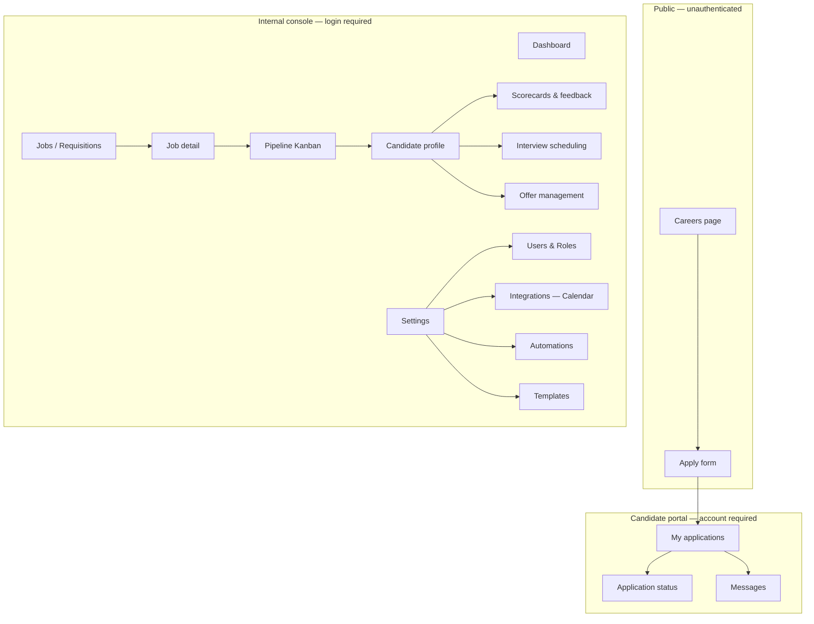
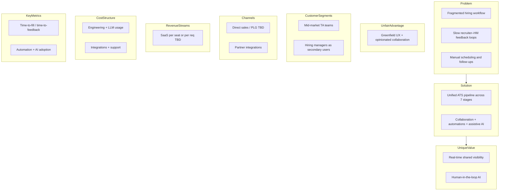
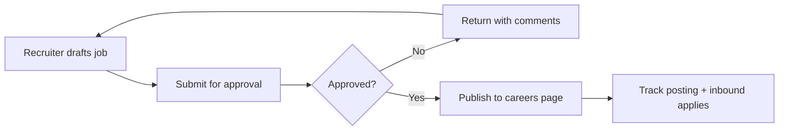
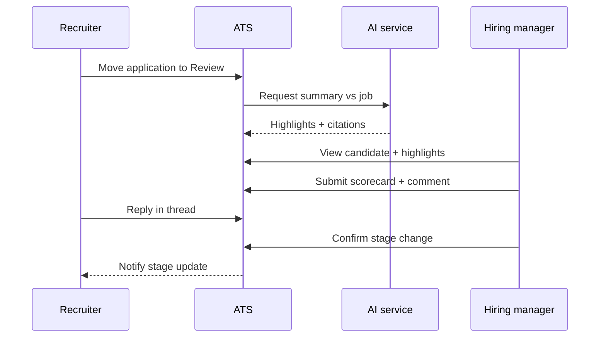
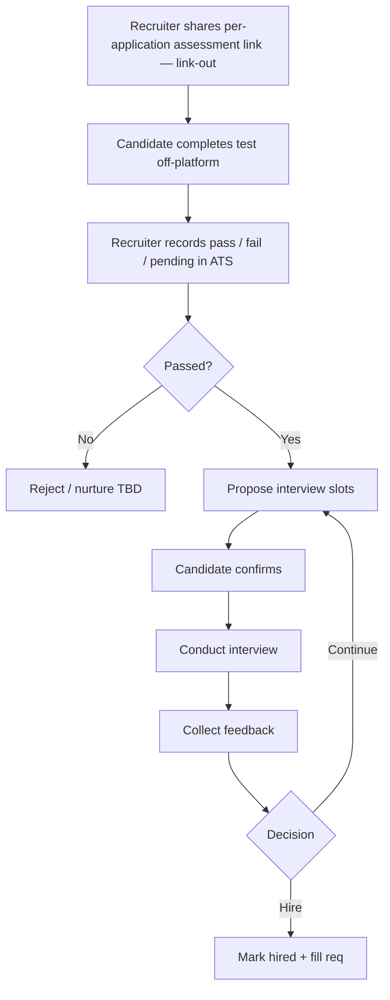
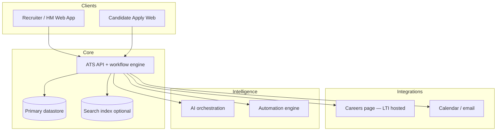
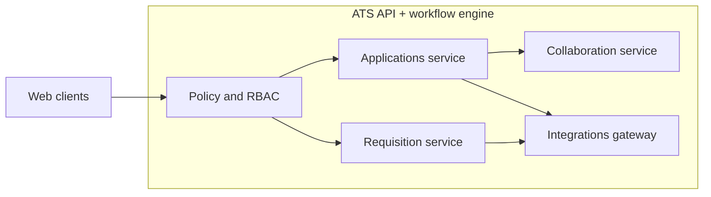

# LTI ATS — Product Requirements Document

## Document control

- **Version:** 1.2
- **Last updated:** 2026-03-29
- **Author / source:** Course brief (ReadMe.md) + seven-stage ATS lifecycle framing; PRD shaped per generate-prd skill. Q&A session (2026-03-28) resolved open questions on platform, vendors, compliance, and team.

## Executive summary

LTI is building a next-generation **Applicant Tracking System (ATS)** from a greenfield position. Recruiting teams still lose time to fragmented tools, slow feedback loops between recruiters and hiring managers, and manual steps across posting, screening, scheduling, and close. This PRD defines an MVP that covers the **end-to-end hiring funnel**—from **job creation** through **hire**—while baking in LTI’s intended differentiators: **HR efficiency**, **real-time recruiter–hiring manager collaboration**, **workflow automations**, and **human-in-the-loop AI assistance** (drafting, ranking support, scheduling nudges—not autonomous hiring decisions).

The recommended direction is a **single coherent ATS workspace** with shared pipeline visibility, configurable stages aligned to the seven lifecycle areas, integrations to the **company careers page**, **Google Calendar**, and **Microsoft Outlook/Teams**, and an **audit-friendly** activity history for screening and decisions. External job board integrations and assessment vendor APIs are deferred to post-MVP phases. MVP should prove collaboration + automation value on one primary persona pair (recruiter + hiring manager) before expanding depth in compliance, global payroll, or niche HRIS variants.

## Goals and non-goals

### Goals

- Support the **seven ATS stages** as first-class capabilities: job creation, job posting, application intake, application review, online assessments, interview scheduling, and hiring selected candidates.
- Reduce time-to-feedback and rework via **shared requisition and candidate views**, comments, @mentions, and **live or near-real-time** updates where feasible.
- Offer **rules-based automations** (e.g., stage transitions, notifications, task creation) with clear ownership and safeguards.
- Embed **AI assistance** for summarization, draft communications, and **assistive** ranking/screening with transparency, overrides, and logging.
- Ship **testable** functional and non-functional requirements suitable for design phases (use cases, data model, high-level architecture).

### Non-goals

- **Final legal interpretation** of employment law, pay equity regulations, or jurisdiction-specific hiring rules (treat as assumptions / open questions).
- **Full HRIS / payroll** implementation as part of MVP (integration hooks may exist; depth is phased).
- **Autonomous** hiring decisions or unsupervised rejection of candidates without human action.
- **Authoritative** typed ERD, deployment topology, or deep C4 as product truth—those belong in architecture deliverables with **develop-architect**.

## Target users and personas

| Persona | Goals | Pains (hypothesis) |
|--------|--------|---------------------|
| **Recruiter / TA** | Fill reqs quickly with quality; keep candidates warm; compliance hygiene | Context switching across email, spreadsheets, boards; chasing HM feedback |
| **Hiring manager** | Fast clarity on fit; minimal admin; confident decisions | Opaque pipeline; slow scheduling; inconsistent scorecards |
| **TA / system admin** | Templates, access control, integrations, reporting | Fragile configs; integration maintenance |
| **Candidate** | Apply easily, track application status, receive timely communications | Black holes; repetitive data entry; no visibility after submitting |

## Stakeholders

| Stakeholder | Type | Rol en el producto |
|-------------|------|--------------------|
| **Recruiter / TA** | Usuario interno | Operador principal del pipeline de contratación |
| **Hiring Manager** | Usuario interno | Revisa candidatos, da feedback, aprueba contrataciones |
| **TA / System Admin** | Usuario interno | Configura la plataforma, gestiona accesos e integraciones |
| **Candidate** | Usuario externo | Aplica a posiciones, consulta estado de su candidatura |
| **Customer Success (LTI)** | Interno LTI | Apoya a empresas piloto durante onboarding y UAT |
| **Empresas Piloto** | Cliente externo | Primeros adoptantes que validan el MVP; firman el sign-off de aceptación |
| **Legal / Compliance (LTI)** | Interno LTI | Valida cumplimiento LGPD y Ley 1581 Colombia para operaciones LATAM |

## Problem statement

Hiring is a **multi-stage workflow** spanning many tools and handoffs. When job creation, posting, intake, review, assessments, interviews, and hire steps are weakly connected, teams duplicate work, lose auditability, and delay decisions. Incumbent ATS products often optimize for checklists rather than **tight collaboration** and **intelligent assistance**, leaving room for LTI to differentiate if execution stays focused.

## Proposed solution (high level)

A unified ATS that models each requisition and application through **configurable pipeline stages** mapped to the seven lifecycle areas, with:

- **Collaboration surfaces** on jobs and candidates (threads, shared scorecards, presence/updates).
- **Automation engine** (rules + triggers) for notifications, tasks, and stage changes within policy.
- **AI layer** for drafts and summaries, plus **assisted** screening with explicit human approval.
- **Integration adapters** for the careers page, calendar (Google + Outlook), and email at MVP breadth. Assessment vendor API integration is deferred to Next phase; MVP uses link-out with manual outcome recording.

## User journeys (summary)

- **Recruiter: req → post → inbound** — Create approved requisition, publish to careers page, monitor applicant volume and source effectiveness.
- **Recruiter + hiring manager: triage → assess → decide** — Shared review of applications, structured feedback, trigger assessments, compare notes before advancing or rejecting.
- **Coordinator: schedule → offer → hire** — Propose interview slots with calendar awareness (Google Calendar / Microsoft Outlook), collect feedback, move to offer/hired with audit trail.
- **Candidate: apply → track → receive feedback** — Submit application via public apply form, create account to track status, receive notifications on stage changes.

## User stories

Stories are grouped by persona and ordered by MVP priority. Each story maps to at least one functional requirement.

### Recruiter / TA

| ID | User story | Acceptance criteria (key) | FR |
|----|-----------|--------------------------|-----|
| **US-001** | As a **recruiter**, I want to create a job requisition from a template so that I can reduce setup time and maintain consistency across postings. | Template library is accessible; all required fields pre-populate; recruiter can edit before saving. | FR-001, FR-003 |
| **US-002** | As a **recruiter**, I want to submit a requisition for approval and receive a notification when it is approved or returned, so that I can act on it without manually following up. | Approval state changes trigger in-app + email notification; returned reqs include reviewer comments. | FR-002, FR-019 |
| **US-003** | As a **recruiter**, I want to publish an approved job to the careers page so that candidates can find and apply to the role immediately. | Job appears on careers page within 60 seconds of publish action; public URL visible on requisition. | FR-004, FR-005, FR-006 |
| **US-004** | As a **recruiter**, I want to view all applications for a job in a pipeline Kanban view so that I can quickly assess volume and triage candidates by stage. | Pipeline shows candidates grouped by stage with owner, stage duration, and timestamps visible. | FR-011, FR-014 |
| **US-005** | As a **recruiter**, I want to move a candidate to a different pipeline stage so that the hiring team always sees the current status. | Stage change is reflected in real time for all collaborators; action is logged in the audit trail. | FR-011, FR-014, FR-026 |
| **US-006** | As a **recruiter**, I want to share an assessment link with a candidate and manually record the outcome so that I can track assessment results within the ATS without needing a vendor API. | Per-application **signed, expiring** assessment link (policy in **Architectural decisions**); recruiter can mark pass / fail / pending; outcome appears on candidate profile. | FR-015, FR-016, FR-017 |

### Hiring Manager

| ID | User story | Acceptance criteria (key) | FR |
|----|-----------|--------------------------|-----|
| **US-007** | As a **hiring manager**, I want to see the same pipeline view as the recruiter so that I have full context on candidate progress without asking for status updates. | HM has read + comment access to all applications on their assigned requisitions; no separate login or portal. | FR-025 |
| **US-008** | As a **hiring manager**, I want to submit a structured scorecard for a candidate after reviewing their profile so that my evaluation is recorded and visible to the recruiting team. | Scorecard form is available on the candidate profile; submission triggers notification to recruiter; score appears in pipeline card. | FR-012, FR-019 |
| **US-009** | As a **hiring manager**, I want to read AI-generated highlights of a resume compared to the job requirements so that I can prepare for an interview faster. | AI summary is clearly labeled as AI-generated; rationale snippets are visible; no stage change occurs automatically as a result. | FR-013, FR-031 |

### Candidate

| ID | User story | Acceptance criteria (key) | FR |
|----|-----------|--------------------------|-----|
| **US-010** | As a **candidate**, I want to apply to a job without creating an account so that I can submit my application quickly without friction. | Apply form accessible at the public careers page URL; CV upload supported; consent checkbox required before submission. | FR-007, NFR-005 |
| **US-011** | As a **candidate**, I want to create an account after applying so that I can track the status of my application and receive updates without checking my email. | Post-apply screen offers account creation; portal shows current stage and last-updated timestamp. | FR-008, FR-028 |
| **US-012** | As a **candidate**, I want to receive a notification when my application moves to a new stage so that I know my application is being actively reviewed. | Email notification sent on every stage change; notification references the job title and new stage name. | FR-019, FR-008 |

### System Admin

| ID | User story | Acceptance criteria (key) | FR |
|----|-----------|--------------------------|-----|
| **US-013** | As a **system admin**, I want to configure role-based access so that recruiters, hiring managers, and candidates each see only what they are authorized to view. | RBAC enforced at API level; role assignment UI available in Settings; unauthorized access attempts are logged. | FR-027, NFR-001, NFR-002 |
| **US-014** | As a **system admin**, I want to configure automation rules (e.g., notify team when a candidate is stale for 5 days) so that the recruiting team never loses track of candidates due to inaction. | Rule builder UI in Settings; rule triggers on correct condition; automation audit log records rule ID, timestamp, and action. | FR-029, FR-030 |

## UX design and experience

*This PRD and **`LTI-ICS.md`** use **English** for headings and course submission consistency.*

### Platform

Responsive web (desktop-first; usable on mobile). No native app in MVP. The internal console (recruiter, HM, admin) is desktop-optimized; the candidate portal and apply form are fully usable on mobile.

### Design principles

1. **Efficiency:** Critical tasks (move candidate stage, send feedback, schedule interview) complete in at most three clicks from the primary view.
2. **Transparency:** Users always see current process state—application, requisition, or external integration—without leaving the active view.

### Design system

LTI does not ship with a prior design system. MVP establishes a reusable component baseline (buttons, inputs, cards, tables, notifications, status badges) extensible in later phases. **WCAG 2.1 AA** applies to all candidate-facing flows (apply form and portal).

### Key screens (MVP)

| Screen | Roles | Functional description |
|--------|-------|------------------------|
| **Dashboard** | Recruiter, HM | Summary of active requisitions, candidates by stage, and pending-action alerts |
| **Pipeline (Kanban)** | Recruiter, HM | Candidates as cards in stage columns; quick actions (move, comment, assign) |
| **Candidate profile** | Recruiter, HM | Documents (CV/resume), activity history, scorecards, AI highlights, comment thread |
| **Apply form (public)** | Candidate | Application form without login; CV upload, profile fields, consent checkboxes |
| **Candidate portal** | Candidate | Authenticated account; active applications, current status, messages from the company |
| **Settings** | Admin | Users and roles, integrations (Google Calendar, Outlook), templates, automations |

### Sitemap

## Functional requirements

Requirements are grouped by the seven ATS stages; cross-cutting **collaboration**, **authentication**, **automation**, and **AI** are called out explicitly.

**Numbering:** **FR-001**–**FR-032** follow **top-to-bottom** reading order in this section (March 2026 renumbering for stable cross-references).

### Job creation

- **FR-001** The system shall allow authorized users to **create and edit job requisitions** with core fields (title, department, location model, employment type, description, compensation band *optional*, headcount, hiring team).
- **FR-002** The system shall support **approval states** for requisitions (e.g., draft → pending approval → approved) *exact policy is configurable assumption*.
- **FR-003** The system shall allow **job templates** and duplication from prior requisitions to reduce setup time.

### Job posting

- **FR-004** The system shall publish approved jobs to the **company careers page** (hosted by LTI ATS). External job board integrations are **out of scope for MVP** *deferred to Next phase*.
- **FR-005** The system shall track **posting status** and **source attribution** for applicants applying through the careers page.
- **FR-006** The system shall allow **scheduling or expiring** postings aligned to requisition status.

### Application intake

- **FR-007** The system shall **collect applications** via a public apply form (upload resume/CV, profile fields, consent checkboxes as required by LGPD and Ley 1581 Colombia). No login required to apply.
- **FR-008** The system shall allow candidates to **create an authenticated account** after applying to track the status of their application(s) and receive messages from the hiring team.
- **FR-009** The system shall **parse and store** application materials and maintain a **single candidate profile** with multiple applications *dedupe rules: email as primary key, manual merge by admin*.
- **FR-010** The system shall support **knockout / minimum qualification** questions configurable per job *human review of edge cases*.

### Application review

- **FR-011** The system shall present applications in a **pipeline view** with stage, owner, and timestamps.
- **FR-012** The system shall support **structured feedback** (scorecards, ratings, free text) from recruiters and hiring managers.
- **FR-013** The system shall provide **AI-assisted summaries or highlights** of resumes against job requirements with **visible rationale snippets** and **mandatory human confirmation** before any negative action *assumption on MVP depth*.
- **FR-014** The system shall log **who changed stage** and when for auditability.

### Online assessments

- **FR-015** The system shall allow **launching an assessment** for a candidate from a pipeline stage and recording **pass/fail/pending** outcome.
- **FR-016** Assessment provider integration is **out of scope for MVP**. MVP supports **link-out only**: the system issues a **signed, expiring URL per application** (see **## Architectural decisions (resolved open questions)**) that redirects the candidate to the third-party assessment; the recruiter **manually** records **pass/fail/pending** in the ATS. A **base assessment landing URL** may be configured **per job requisition**; the **attributable link** to the candidate is always **per application**. API-based integration is deferred to Next phase.
- **FR-017** The system shall restrict visibility of assessment results to **role-appropriate** users.

### Interview scheduling

- **FR-018** The system shall support **proposed interview slots**, participant roles, and **calendar availability** integration with **Google Calendar** and **Microsoft Outlook/Teams** *OAuth-based integration; read availability + create events*.
- **FR-019** The system shall send **notifications** (email and in-app) for invites, changes, and reminders.
- **FR-020** The system shall associate **interview feedback** with the application record.

### Hiring selected candidates

- **FR-021** The system shall support marking a candidate as **hired** and capturing **start date** and **requisition fill** status.
- **FR-022** The system shall support **rejection** with templated messaging and **opt-out / consent** respect under LGPD and Ley 1581 Colombia *wording subject to legal review*.
- **FR-023** The system shall generate **basic hiring funnel metrics** per requisition (time-in-stage, conversion rates).
- **FR-024** The system shall support **basic offer management**: mark offer as sent, record **expected response date**, and capture outcome (accepted / declined / no response). E-signature integration is out of scope for MVP.

### Collaboration (cross-cutting)

- **FR-025** The system shall provide **shared visibility** of the same candidate record to recruiter and hiring manager roles with **permission boundaries**.
- **FR-026** The system shall support **real-time or near-real-time** updates (e.g., comments, stage changes) so collaborators see changes without manual refresh *implementation depth is architecture-owned*.

### Authentication

- **FR-027** The system shall support **email + password authentication** for internal users (recruiter, HM, admin). SSO (Google, Microsoft) is out of scope for MVP.
- **FR-028** The system shall support **candidate account creation** post-apply (email + password) for accessing the candidate portal.

### Automation (cross-cutting)

- **FR-029** The system shall allow **rule definitions** (trigger → actions) such as “application submitted → notify hiring team” or “stale stage N days → task.”
- **FR-030** The system shall provide an **automation audit log** (rule id, actor/system, timestamp).

### AI assistance (cross-cutting)

- **FR-031** The system shall expose AI features only with **tenant-configurable** enablement and **role-based** access.
- **FR-032** The system shall record **AI-generated outputs** linked to the target record for traceability *retention policy TBD*.

## Non-functional requirements

**Numbering:** NFR identifiers **NFR-001**–**NFR-011** follow **top-to-bottom order** in this section (not insertion history).

### Security and privacy

- **NFR-001** Role-based access control (RBAC) shall enforce least privilege on candidate PII and assessment results.
- **NFR-002** The system shall support **audit trails** for critical actions (stage changes, offers, rejections, AI-assisted recommendations).

### Candidate PII privacy lifecycle — LATAM compliance

- **NFR-003** The system shall enforce **configurable retention windows** for candidate and applicant PII by category (e.g., active pipeline, rejected, hired, withdrawn), including **system-enforced** limits on continued processing and routine access after a retention period expires. Retention policies must comply with **LGPD (Brazil)** and **Ley 1581 de 2012 (Colombia)**. Only **authorized roles** (per **NFR-001**) shall configure retention policies or approved exceptions; **changes to retention policy** and **scheduled enforcement events** SHALL be **recorded in audit trails** per **NFR-002**.

- **NFR-004** The system shall support **automated** lifecycle actions (e.g., scheduled archival, queued deletion, **secure purge** of application data from primary stores and search/index replicas when due) and **manual** deletion or erasure workflows initiated by **privacy/admin** roles (per **NFR-001**). Each **deletion, anonymization, redaction, or purge** SHALL emit **audit events** per **NFR-002** including actor (user or system job), target scope, action type, timestamp, and outcome.

- **NFR-005** The system shall process **consent withdrawal** and similar objections by updating processing flags, stopping consent-dependent processing, and **triggering** applicable retention or erasure flows. The apply form shall collect **explicit informed consent** per LGPD and Ley 1581, recording consent basis, timestamp, and version of the privacy notice presented. It SHALL apply **data minimization** — collect and retain only fields necessary for declared purposes. Withdrawal and minimization-related actions SHALL be **permissioned** per **NFR-001** and **auditable** per **NFR-002**.

- **NFR-006** The system shall provide **export / portability** of applicant and candidate data pertinent to a verified **subject or regulatory request** in a **structured, portable** form (JSON or CSV). Fulfillment SHALL be **RBAC-gated** per **NFR-001**, and each export, download, or disclosure package generation SHALL be **logged** per **NFR-002** (who, what scope, when).

### Performance and reliability

- **NFR-007** Core pipeline Kanban view (applications per job) shall load with a **P95 response time ≤ 2 seconds** at the API boundary under a baseline load of **50 concurrent internal users**. Client-side rendering time is excluded from this SLO. Re-evaluated if pilot adoption exceeds baseline.
- **NFR-008** The platform shall target **RTO ≤ 4 hours** and **RPO ≤ 1 hour** for MVP. Met via managed cloud infrastructure with automated failover and PostgreSQL point-in-time recovery (continuous WAL archiving). Targets tighten to RTO ≤ 1 h / RPO ≤ 15 min in Next phase as pilot SLAs harden.

### Accessibility and inclusion

- **NFR-009** Candidate-facing apply flows shall target **WCAG 2.1 AA** *validation approach TBD*.

### Observability

- **NFR-010** The system shall emit **structured logs/metrics** for integration failures on **MVP integrations**: **careers page posting/sync**, **email**, and **calendar** providers, and for **LLM provider** errors on AI-assisted flows. *Per **FR-016**, there is **no** third-party **assessment vendor API** in MVP—operational visibility for assessments emphasizes **in-app events** (e.g. link issued, outcome recorded) rather than external assessment connector failures.*

### Fairness (AI)

- **NFR-011** AI-assisted screening shall support **disclosure** to internal users that output is probabilistic; shall not be sole criterion for auto-reject without human action in MVP.

## Success metrics

- **Time to first hiring manager feedback** on new applications (median hours).
- **Recruiter active time** per hire on scheduling and follow-ups *(leading indicator)*.
- **Interview schedule lead time** (invite sent → confirmed).
- **Offer acceptance rate** and **time-to-fill** per requisition *(lagging)*.
- **Automation adoption**: % of reqs with at least one active rule; **override rate** on AI suggestions *(quality guardrail)*.

## Milestones / phasing

**MVP target date: 2026-06-27** (3 months from 2026-03-28). Team: 1 PM, backend engineers, frontend engineers, DevOps. No dedicated QA — testing responsibility shared with engineers.

| Phase | Dates | Scope | Exit criteria |
|-------|-------|-------|---------------|
| **Phase 0 — Setup** | Apr 1–Apr 14 | Infra, CI/CD pipeline, auth (email + password), base schema, RBAC skeleton, multi-tenant scaffold | Environments up; auth end-to-end working; DB migrations running |
| **Phase 1 — Core pipeline** | Apr 15–May 9 | Job requisitions (FR-001/002/003), careers page + apply form (FR-004/007/008/009/010), pipeline Kanban view (FR-011/014), candidate profile, basic notifications | Recruiter can create req, publish to careers page; candidate can apply and see pipeline |
| **Phase 2 — Collaboration & integrations** | May 10–Jun 6 | Scorecards & feedback (FR-012/019), calendar integrations Google + Outlook (FR-018/019), candidate portal with auth + status (FR-008/028), interview scheduling flow, AI summaries (FR-013/031/032) | HM can view shared pipeline and submit scorecard; interview scheduled via calendar invite |
| **Phase 3 — Automations, offer & hardening** | Jun 7–Jun 20 | Automations engine (FR-029/030), basic offer management (FR-024), audit trail completion (FR-014/NFR-002), data retention + consent flows (NFR-003–006), performance tuning | All FRs verifiable; audit trail complete; consent flows compliant with LGPD + Ley 1581 |
| **UAT** | Jun 21–Jun 27 | Pilot customer sign-off session; bug fixes only (no new scope) | Pilot customer sign-off received; P0/P1 bugs resolved |
| **MVP launch** | Jun 28, 2026 | Production deployment | — |

| Phase | Scope |
|-------|--------|
| **Next** | External job board integrations (LinkedIn, Computrabajo, Indeed), assessment provider API integration, SSO (Google + Microsoft), advanced analytics workspace, expanded compliance tooling, e-signature for offer management. |

## MVP acceptance criteria

The MVP is **done** when **all** of the following are verifiable.

### End-to-end functional flows

| ID | Criterion | Verification |
|----|-----------|--------------|
| **AC-001** | UC-1 complete: a recruiter can create a requisition, obtain approval, and publish it to the **company careers page** (no third-party job board required for MVP). | Functional demo in staging |
| **AC-002** | UC-2 complete: a candidate applies via the public form; recruiter and HM see the application on the shared pipeline, add a scorecard, and advance or reject with an audit trail. | Functional demo in staging |
| **AC-003** | UC-3 complete: assessment **link-out** (FR-016): recruiter issues **per-application signed** external assessment URL; recruiter **manually** records pass/fail/pending; interview scheduling uses calendar integration (Google or Outlook); candidate receives notification; hiring team marks **hired** with audit trail. | Functional demo in staging |
| **AC-004** | Candidate can create a post-apply account and view current application status in the portal. | Functional demo in staging |
| **AC-005** | Basic offer management: mark offer sent, capture expected response date, record outcome (accepted / declined). | Functional demo in staging |

### Security and access control

| ID | Criterion | Verification |
|----|-----------|--------------|
| **AC-006** | An HM cannot see another organization’s requisitions or candidates (tenant isolation). | Test with two tenants |
| **AC-007** | A candidate cannot see internal pipeline views or scorecards for their application. | Test with candidate session |

### Compliance and privacy (LATAM)

| ID | Criterion | Verification |
|----|-----------|--------------|
| **AC-008** | Apply form includes consent checkbox referencing the privacy policy; consent stored with timestamp and policy version. | DB review + legal review |
| **AC-009** | An admin can initiate candidate profile deletion/anonymization; event appears in the audit trail. | Functional demo |

### Sign-off

| ID | Criterion | Verification |
|----|-----------|--------------|
| **AC-010** | Pilot customer completes UAT and signs MVP acceptance; all P0/P1 defects resolved before sign-off. | Signed acceptance from pilot representative |

## Risks, assumptions, dependencies

- **Risks:** Integration fragility with calendar providers (Google + Outlook OAuth); AI perception risk if not transparent; scope creep in LATAM compliance requirements.
- **Assumptions:** MVP targets LATAM mid-market companies (initial pilots in Colombia and Brazil); **multi-tenant MVP posture:** shared schema with **row-level tenant scope** via **`organization_id`** on tenant data, enforced in the **application layer** for MVP (**ADR-002** in **`LTI-ICS/ADR.md`**); optional **PostgreSQL Row-Level Security (RLS)** remains a later hardening step if compliance drivers require it.
- **Dependencies:** Google Calendar API + Microsoft Graph API (OAuth), email delivery provider (SES or similar), LGPD/Ley 1581 legal templates for candidate communications and privacy notices.

## Decisions log (previously Open questions)

The following questions from earlier versions have been resolved in the 2026-03-28 Q&A session:

| Question | Decision |
|----------|----------|
| Which **job boards** are in scope for MVP? | **Only the company careers page** hosted by LTI ATS. External board integrations (LinkedIn, Computrabajo, Indeed) deferred to Next phase. |
| Which **assessment** vendors are in scope? | Assessment provider API integration is **out of scope for MVP**. **Link-out only**: signed **per-application** URL + **manual** outcome recording in ATS (see **Architectural decisions**). Provider TBD for Next phase. |
| **Calendar** integration vendor? | **Google Calendar + Microsoft Outlook/Teams** (both, OAuth-based). |
| **Candidate portal** depth? | **Full portal in MVP**: anonymous apply form + authenticated candidate account to track status and receive messages. |
| **Dedupe** strategy? | Email as primary deduplication key. Manual merge by admin for edge cases. |
| **Data residency / DPA** constraints? | LATAM markets: **LGPD (Brazil)** + **Ley 1581 de 2012 (Colombia)**. |
| **Offer management** in or out of MVP? | **In MVP** — basic: mark offer sent, expected response date, outcome capture. E-signature deferred to Next phase. |
| **Authentication** method? | **Email + password** for all users (internal and candidate). SSO deferred to Next phase. |

## Architectural decisions (resolved open questions)

All previously open questions have been resolved. Items from the initial Q&A session are in the **Decisions log** above. The four technical questions resolved in the architect review are listed here.

| Question | Decision | Rationale |
|----------|----------|-----------|
| **Numeric SLO** for pipeline view load time (`NFR-007`) | **P95 ≤ 2 s** for the pipeline Kanban view (applications list per job) under a baseline load of **50 concurrent internal users**. Measured at the API response boundary, excluding client rendering. | Mid-market ATS target segment; 50 concurrent users covers a typical team with room for burst. 2 s is the established UX threshold for perceived responsiveness on data-dense list views. Re-evaluate at scale if pilot adoption exceeds baseline. |
| **RTO / RPO targets** for MVP (`NFR-008`) | **RTO: 4 hours** (time to restore service after incident). **RPO: 1 hour** (maximum data loss window). | Greenfield MVP on managed cloud infrastructure (single-region). 4 h RTO is achievable with automated failover + runbooks without a 24/7 on-call rotation for a small team. 1 h RPO is met by continuous WAL archiving / point-in-time recovery on PostgreSQL. Tighten to RTO ≤ 1 h / RPO ≤ 15 min in Next phase as pilot SLAs harden. |
| **Assessment link-out URL format** — per-job or per-candidate token? | **Per-candidate, per-application token** (signed, expiring URL). Format: `https://<domain>/assess/{application_id}?token={signed_jwt}&exp={unix_ts}`. Token expires in **72 hours**. | Per-job URLs cannot attribute outcomes to individual candidates or prevent link sharing. A per-application signed token ties the redirect to a specific `application_id`, enabling reliable audit trail entries (FR-015, FR-016) and expiry enforcement without a vendor API. JWTs are verifiable stateless; no new DB table required for MVP. |
| **Legal wording** for rejection templates and consent notices (LGPD + Ley 1581) | **Consent notice**: reference a versioned privacy policy URL in the apply form (`/privacy/v{N}`); store `policy_version` and `consented_at` on the `Application` record (NFR-005). **Rejection template**: use neutral language — *"After careful review we will not be moving forward at this time"* — with opt-out link for future communications. Final copy must be reviewed and signed off by LTI Legal before production deploy. | Storing `policy_version` enables demonstrating consent to a specific notice text (LGPD Art. 8; Ley 1581 Art. 9). Neutral rejection language avoids implying discriminatory criteria. Legal sign-off is a gate on AC-008 (acceptance criteria). |

## Lean Canvas

## Use cases

### UC-1 — Create, approve, and post a job

**Actors:** Recruiter, Hiring manager (approver), System admin (optional).  
**Goal:** Publish an approved opening to the **company careers page** (MVP scope; external job boards are deferred to Next phase per **FR-004**).  
**Success:** Job is visible to candidates on the careers page; hiring team notified; application link tracked on the requisition.

A recruiter drafts a requisition from a template, routes it for approval, and upon approval publishes to the careers page. Posting status and the public application link are visible on the requisition record.

### UC-2 — Collaborative application review with assistive AI

**Actors:** Recruiter, Hiring manager, AI assistant (system).  
**Goal:** Triage and evaluate applicants with shared feedback and optional AI highlights.  
**Success:** Stage changes are justified, logged, and visible to both roles; no auto-reject without human action.

The hiring manager sees new applications in a shared pipeline view, reads AI-generated highlights (clearly labeled), adds a scorecard, and discusses in-thread with the recruiter. They advance or reject with audit trail.

### UC-3 — Assessment, interview, and hire

**Actors:** Recruiter, Hiring manager, Candidate; **third-party assessment** is **out of band** (link-out URL per **FR-016**).  
**Goal:** Move finalist through **manual-recorded** assessment outcome, interviews, and hire.  
**Success:** Assessment status recorded in ATS; scheduled interviews; captured feedback; clear hired outcome on requisition.

Recruiter issues the **per-application signed assessment link** (see **Architectural decisions**); candidate completes the test **outside** LTI ATS; recruiter **manually** records **pass/fail/pending** (**FR-015**/**FR-016**). On pass, the team proposes interview slots (calendar integration **FR-018**/**FR-019**); candidate confirms; interviewers submit feedback (**FR-020**); hiring team marks hire (**FR-021**) and updates the req.

## Data model (conceptual)

*Conceptual only—finalize cardinalities and engineering types with **develop-architect** / typed ERD.*

| Entity | Purpose | Key attributes (conceptual) | Relationships |
|--------|---------|----------------------------|---------------|
| **Organization** | Tenant boundary | `id`, `name` | 1..* **User**; aggregates tenant-owned entities below |
| **User** | Login identity | `id`, `organization_id`, `email`, `role` | belongs to **Organization** |
| **JobRequisition** | Hiring need | `id`, `organization_id`, `title`, `status`, `headcount` | belongs to **Organization**; *posts* **JobPosting**; *has* **Application** |
| **JobPosting** | Channel-specific publication | `id`, `organization_id`, `channel`, `status`, `url` | belongs to **Organization**; belongs to **JobRequisition** |
| **Candidate** | Person *(tenant view)* | `id`, `organization_id`, `name`, `contact` | belongs to **Organization**; *submits* **Application** *assumption (MVP): candidate profile is **organization-scoped**; cross-org dedupe/global identity is out of scope unless raised in Open questions* |
| **Application** | Candidate + job instance | `id`, `organization_id`, `stage`, `submitted_at` | belongs to **Organization**; links **Candidate** ↔ **JobRequisition** |
| **AssessmentAttempt** | Test run | `id`, `organization_id`, `status`, `score_summary` | belongs to **Organization**; belongs to **Application** |
| **Interview** | Scheduled event | `id`, `organization_id`, `start_time`, `format` | belongs to **Organization**; belongs to **Application** |
| **Feedback** | Review notes/scorecard | `id`, `organization_id`, `author`, `payload` | belongs to **Organization**; targets **Application** |
| **AutomationRule** | Trigger/action | `id`, `organization_id`, `definition`, `enabled` | belongs to **Organization** |
| **AuditEvent** | Traceability | `id`, `organization_id`, `action`, `actor`, `timestamp` | belongs to **Organization**; references domain records *(same `organization_id` as the record being audited, for tenant-isolated audit queries)* |

## High-level system design

At product depth, LTI ATS is a **web application** backed by a **core API** enforcing RBAC and workflow rules. **Integration services** connect to the **company careers page**, **email**, and **calendar** providers for MVP (**FR-004**, **FR-018**–**FR-019**). **Third-party job boards** and **assessment vendor APIs** are **deferred**; assessments use **per-application signed link-out** URLs with **manual** outcome capture (**FR-016**). An **AI orchestration** component calls model APIs with retrieved job/application context, stores outputs for audit, and never bypasses authorization.

## C4 component focus (draft)

*Draft for course alignment—**develop-architect** should refine boundaries, protocols, and trust zones.*

**Container in focus:** `ATS API + workflow engine`  
**Components (illustrative):**

- **Requisition service** — approvals, templates, job metadata.
- **Applications service** — intake, pipeline stages, dedupe hooks.
- **Collaboration service** — comments, notifications, real-time fan-out *technology TBD*.
- **Integrations gateway** — normalizes external provider calls; retries and dead-letter handling.
- **Policy & RBAC** — authorization decisions shared across services.

## Appendix

### Glossary

- **ATS:** Applicant Tracking System.
- **Requisition / req:** Internal hiring record for a role.
- **Application:** A candidate’s submission against a specific requisition.
- **Pipeline stage:** A step in the hiring funnel (maps to one or more of the seven lifecycle areas).
- **Link-out assessment:** An assessment flow where the candidate follows a **signed, expiring URL per application** to an external provider; the ATS records **pass/fail/pending manually** — no vendor API integration in MVP.
- **RPO (Recovery Point Objective):** Maximum acceptable data loss measured in time (e.g., RPO ≤ 1 h means at most 1 hour of data may be lost in an incident).
- **RTO (Recovery Time Objective):** Maximum acceptable downtime before service is restored (e.g., RTO ≤ 4 h means service is back within 4 hours of an incident).
- **P95 response time:** The 95th-percentile latency — 95% of requests complete within this threshold.
- **LGPD:** Lei Geral de Proteção de Dados — Brazil’s data protection law.
- **Ley 1581:** Ley 1581 de 2012 — Colombia’s personal data protection statute.
- **Tenant:** An organization using LTI ATS; data is isolated per tenant via `organization_id`.

### References

- Repository **`ReadMe.md`** — LTI exercise context and deliverable checklist.
