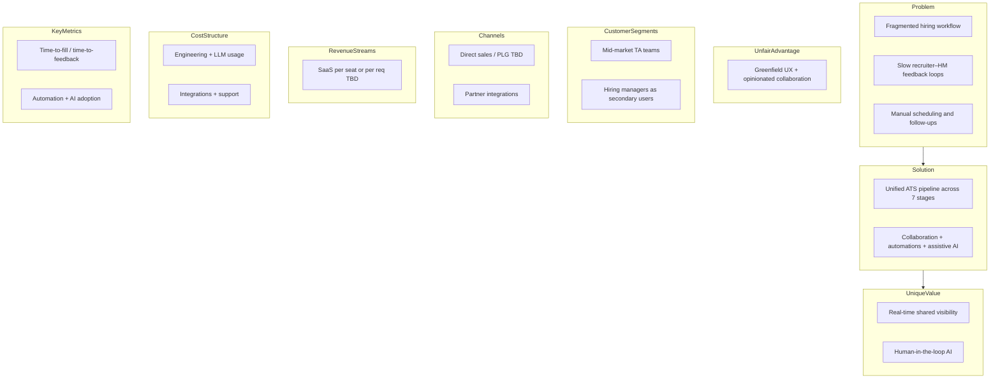
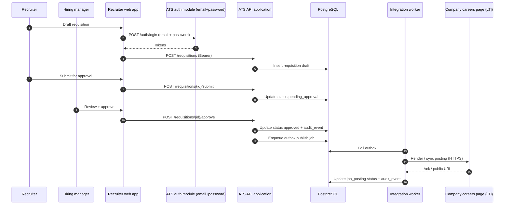
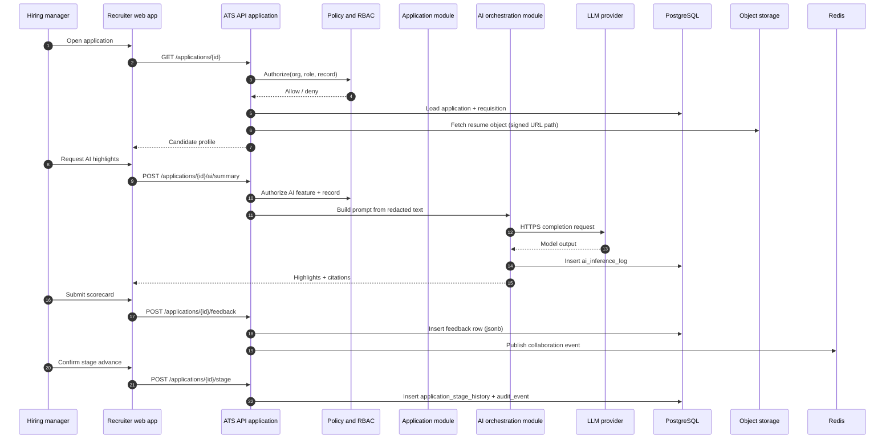
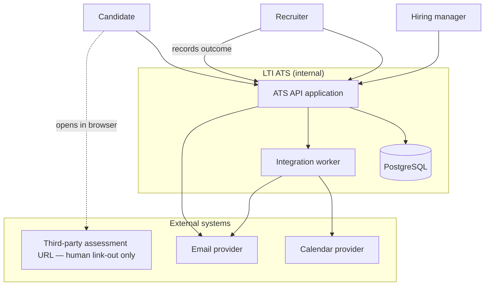
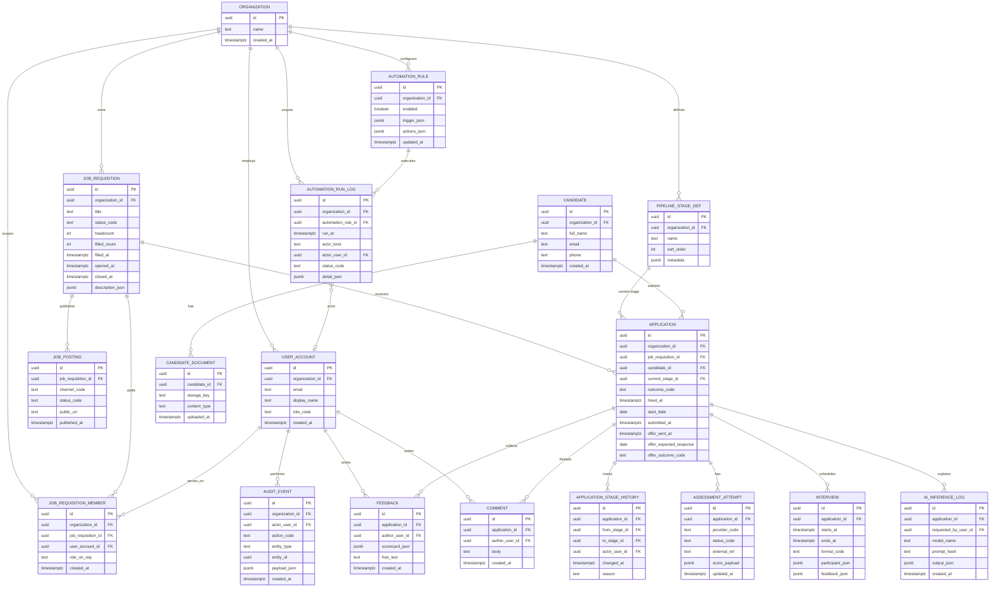
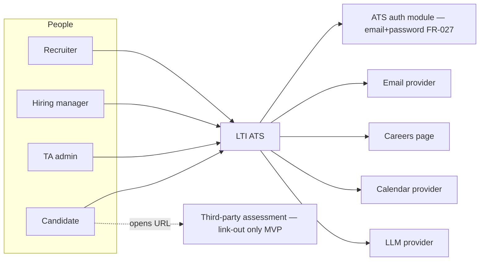
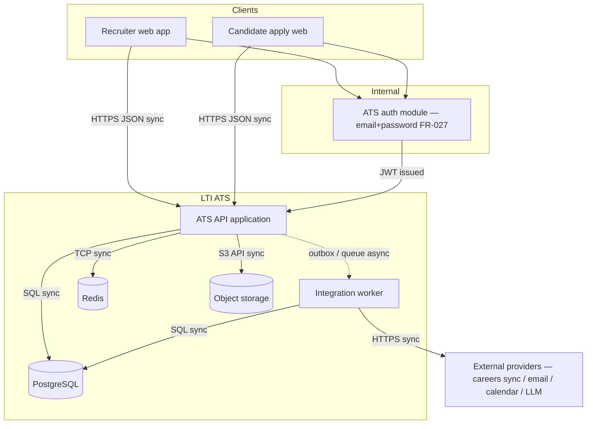
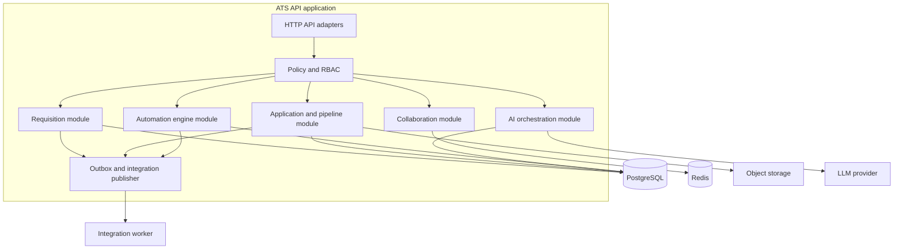

# LTI ATS — System design (ICS)

This document is the **consolidated design** for contributor folder **LTI-ICS**. **Product intent** is defined in **[001-prd.md](./001-prd.md)** (version in that file’s **Document control**). **Architecture decisions** are logged in **[ADR.md](./ADR.md)**.

## Brief description, added value, and competitive advantages

**LTI** is a greenfield **Applicant Tracking System (ATS)** spanning the full hiring funnel: **job creation → posting → intake → review → assessments → interview scheduling → hire**. The design targets mid-market TA teams where recruiters and hiring managers lose time to fragmented tools and slow feedback loops.

**Added value**

- **End-to-end workflow** in one system of record, with **audit-friendly** history for pipeline moves and decisions (aligns with FR-011, FR-014, FR-023; NFR-002).
- **Shared visibility** and **near-real-time** updates for recruiter–hiring manager collaboration (FR-025, FR-026; ADR-004).
- **Automations** with an explicit **automation audit log** (FR-029, FR-030).
- **Assistive AI** for summaries and highlights with **human-in-the-loop** controls and persisted inference logs (FR-013, FR-031–FR-032; NFR-011; ADR-005).

**Competitive advantages** (hypothesis, to validate with pilots)

- **Opinionated collaboration** rather than checklist-only ATS UX.
- **Transparency** for AI outputs (citations, logging) to reduce “black box” risk.
- **Integration-first** posture with a dedicated **worker** boundary for unreliable externals (ADR-001), improving operability (NFR-010).

## Research and analysis

**Problem themes** (from PRD / course brief): tool fragmentation, latency in hiring-manager feedback, manual scheduling, weak auditability across stages.

**Architectural drivers** (prioritized for MVP)

1. **Security and privacy of candidate PII** (NFR-001) → strong **tenant scoping** and RBAC on every read/write path (ADR-002).
2. **Auditability** for hiring decisions and AI assistance (NFR-002, FR-032) → immutable-style **audit** and **AI inference** logs in the relational model.
3. **Operability of integrations** (NFR-010) → **async worker**, retries, and structured failure signals (ADR-001).
4. **Time-to-market** → **modular monolith** API before service explosion (ADR-001).

**Open questions** (architecture-relevant): data residency, RLS hardening, future external job-board and assessment **API** vendors (MVP: careers page + **per-application signed** assessment **link-out** only), retention/deletion for resumes and AI logs—see PRD **Architectural decisions** and **ADR-003** consequences.

## Main functions

Functions follow the **seven ATS stages** in **001-prd.md**, grouped for clarity.

| Area | Capabilities (summary) | PRD trace |
|------|------------------------|-----------|
| **Job creation** | Requisitions, approvals, templates, hiring team | FR-001–FR-003 |
| **Job posting** | **Company careers page** (LTI-hosted) only for MVP; posting status and source attribution | FR-004–FR-006 |
| **Application intake** | Apply flow, resume storage, knockout questions, dedupe hooks | FR-007–FR-010 |
| **Application review** | Pipeline view (**owner** derived from hiring team; see Data model notes), scorecards, stage history, assistive AI | FR-011–FR-014 |
| **Online assessments** | **Per-application signed** link-out URL, **manual** pass/fail/pending recording, RBAC on results | FR-015–FR-017 |
| **Interview scheduling** | Slots, calendar integration, notifications, interview feedback | FR-018–FR-020 |
| **Hire / reject** | Hired/rejected outcomes, templated comms, funnel metrics, basic offer management | FR-021–FR-024 |
| **Cross-cutting** | Shared visibility, realtime updates, internal + candidate auth, automations, AI toggles | FR-025–FR-032 |

## Lean Canvas

The canvas below matches the PRD narrative; it is **product-owned** and repeated here so the **single submission file** remains self-contained.

## Use cases

Each use case includes a **short narrative** and **one diagram**, aligned with **001-prd.md** but refined for **auth**, **data stores**, and **externals** where relevant.

### UC-1 — Create, approve, and post a job

**Narrative:** A recruiter drafts a **Job requisition** from a template and submits it for approval. An authorized hiring manager approves via the **Recruiter web app** (authenticated via the **ATS auth module** (email + password, **FR-027**; no external SSO in MVP)). Once approved, the **ATS API** creates **Job posting** records for the **company careers page** (FR-004: **no third-party job boards in MVP**). Publish may run synchronously in the API or via **outbox** to the **integration worker** when retriable (ADR-001). The **PostgreSQL** database holds requisition and posting state; **audit events** record approval and publish actions.

### UC-2 — Collaborative application review with assistive AI

**Narrative:** A recruiter moves an **Application** to the review stage. The hiring manager opens the candidate profile; **Policy and RBAC** ensures both see only data allowed for their roles within the **Organization**. The hiring manager requests **AI highlights**; the **AI orchestration module** fetches authorized job and resume text from **PostgreSQL** / **object storage**, calls the **LLM provider** over TLS, and persists a row in **`ai_inference_log`**. The manager submits a **scorecard** (stored as structured **JSONB**); **Collaboration** events (comments) fan out via **Redis** pub/sub to subscribed clients over **WebSocket** (ADR-004). A **stage change** is performed only by an explicit user action and writes **`application_stage_history`** plus **`audit_event`**.

### UC-3 — Assessment, interview, and hire

**Narrative:** For **MVP assessments (FR-016)**, the recruiter issues a **per-application signed assessment link** (policy in PRD **Architectural decisions**); the candidate completes the test **outside** LTI ATS. The recruiter **manually** records **pass/fail/pending** on the **Assessment attempt** row—there is **no API exchange** with vendors in MVP. For **interviews**, the **integration worker** handles **calendar** and **email** provider calls (may be async); the API proposes slots and stores **Interview** + feedback. **Hire** updates **Application** outcome and **Job requisition** fill counters, with audit entries.

## Data model

The model below is **relational**, **typed**, and **implementation-oriented** for MVP engineering. Cardinalities follow Mermaid `erDiagram` notation. Names align with the PRD glossary (**Job requisition**, **Application**, **Candidate**).

**Notes**

- **`organization_id`** on all primary tenant tables supports **ADR-002**. Child tables that are always accessed through a parent with `organization_id` (e.g. `CANDIDATE_DOCUMENT` via `CANDIDATE`, `APPLICATION_STAGE_HISTORY` / `ASSESSMENT_ATTEMPT` / `INTERVIEW` / `FEEDBACK` / `COMMENT` / `AI_INFERENCE_LOG` via `APPLICATION`) rely on **join-path tenant scoping** rather than a redundant column. All query paths MUST filter through a parent row whose `organization_id` is already RBAC-verified.  
- **`scorecard_json`**, **`metadata`**, and automation definitions use **JSONB** for evolving shapes without blocking MVP.  
- **FR-001 (hiring team):** **`job_requisition_member`** links **`user_account`** to **`job_requisition`** with **`role_on_req`** (e.g. **primary_recruiter**, recruiter, hiring_manager, coordinator). The **`primary_recruiter`** role is the default source for the **FR-011** pipeline **owner** when no per-application override exists. At least one member with an approver-capable role is required before publish when the org enables approval workflows (policy enforced in the application layer).  
- **FR-001 (department / location / employment type / compensation):** The PRD’s **department**, **location model**, **employment type**, and optional **compensation band** are carried in **`job_requisition.description_json`** for MVP, with **first-class columns** introduced later only if reporting, search, or external feeds require normalized, queryable fields.  
- **FR-011 (pipeline “owner”):** MVP does **not** add **`owner_user_id`** on **`application`**. The **owner** shown in the pipeline view is **derived** from **`job_requisition_member`**: prefer the member with **`role_on_req = primary_recruiter`** for that application’s **`job_requisition`**; if **zero or multiple** matches, use an org-defined fallback (e.g. the sole **`recruiter`** member, or **unassigned**). If the product later needs **per-application** ownership independent of the req team, add nullable **`application.owner_user_id`** and treat derivation as the default when it is null.  
- **FR-021 (hire / fill):** **`application.hired_at`** and **`application.start_date`** capture hire timing; **`job_requisition.filled_count`** increments on hire (capped by **`headcount`**), and **`job_requisition.filled_at`** is set when **`filled_count`** first reaches **`headcount`** (or when the req is manually closed as filled—**business rule** in use-case layer).  
- **FR-030 (automation audit log):** each rule evaluation or fired action appends **`automation_run_log`** with **`automation_rule_id`**, **`run_at`**, **`actor_kind`** (`system` \| `user`), **`actor_user_id`** set only when **`actor_kind`** is `user` (null for fully system-triggered runs), plus **`status_code`** and optional **`detail_json`** (e.g. action results, errors). Distinct from **`audit_event`** (general domain audit); automation runs may **also** emit **`audit_event`** for critical side effects.  
- **FR-024 (offer management):** `application.offer_sent_at` records when the offer was issued; `application.offer_expected_response` is the date by which a response is expected; `application.offer_outcome_code` captures the result (`accepted` \| `declined` \| `no_response`). E-signature and compensation approval are out of scope for MVP; those may require a separate `OFFER` entity in a later revision.  
- **Dedupe** rules for candidates resolved in **001-prd.md** Decisions log: **email as primary key**; admin-initiated manual merge for edge cases. A `candidate_fingerprint` column or link table may be added in a later revision if phone or resume-hash matching is needed.

## High-level system design

### Narrative

End users interact with **two web clients**: an internal **Recruiter web app** (recruiters, hiring managers, admins) and a **Candidate apply web** experience. Both call the **ATS API application** over **HTTPS** with **Bearer tokens** issued by the **ATS auth module** (see *Authentication note* below). Candidates may apply without an account (**FR-007**) or create a post-apply account for portal access (**FR-008**, **FR-028**).

The API enforces **Policy and RBAC**, mutates **PostgreSQL**, reads/writes **object storage** for resumes, and publishes **integration commands** and **domain events** through an **outbox** for the **integration worker**. The worker handles **careers-page publishing** (and future external job boards), **email**, and **calendar** integrations—retries and dead letters satisfy NFR-010. **Assessment vendor APIs are out of scope for MVP (FR-016)**; candidates use **signed, per-application link-out** URLs (policy in PRD **Architectural decisions**), and recruiters **manually** record outcomes in-app.

**Redis** backs **pub/sub** (and optional cache) for collaboration notifications (ADR-004). **Search index** (OpenSearch/Elasticsearch) remains **optional**; list views can rely on indexed SQL for MVP.

> **Authentication note:** The **ATS auth module** shown in diagrams is an **internal component** of the ATS API application — not an external identity provider. Authentication uses **email + password** per **FR-027**; the module issues short-lived **JWTs** consumed by other modules for authZ decisions. **External SSO** (Google, Microsoft) is **out of scope for MVP** (deferred per Decisions log).

### C4 context

Shows **people**, **LTI ATS** as the system under design, and **external dependencies**. Arrows are logical data/control flow; protocols stated where it matters.

### C4 containers

Depicts **deployable** pieces and **sync vs async** boundaries. **Solid** lines: synchronous on request path. **Dashed**: asynchronous via outbox/queue to the worker.

## C4 component view (in depth): ATS API application

**Chosen container:** **ATS API application** (ADR-001). The diagram shows **internal modules** (clean architecture–friendly). **Dependencies point inward** toward domain rules encapsulated behind module facades; **adapters** implement HTTP, persistence, Redis, object storage, and outbound integration enqueue.

**Responsibilities**

- **HTTP API adapters:** OpenAPI-shaped REST endpoints, input validation, authN via internal **ATS auth module** (email + password per **FR-027**; issues JWTs consumed by other modules).
- **Policy and RBAC:** Central authorization on **organization_id** scope and role codes (NFR-001).
- **Requisition module:** approvals, templates, **hiring team membership** (`job_requisition_member`), postings orchestration (FR-001–FR-006).
- **Application and pipeline module:** intake, stages, history, **pipeline owner resolution** (FR-011: derived **`primary_recruiter`** on **`job_requisition_member`**, with documented fallbacks), **hire timestamps and start date**, requisition **fill counters**, metrics hooks (FR-007–FR-014, FR-021–FR-023).
- **Collaboration module:** comments and realtime event publish to **Redis** (FR-025–FR-026).
- **Automation engine module:** rule evaluation, scheduled triggers, append-only **`automation_run_log`** rows per run (rule id, actor/system, timestamp, outcome) (FR-029–FR-030).
- **AI orchestration module:** prompt build, provider call, **ai_inference_log** persistence (FR-013, FR-031–FR-032; ADR-005).
- **Outbox and integration publisher:** writes outbox rows transactionally with domain changes; worker consumes (ADR-001).

## Traceability

| Topic | Sources |
|--------|---------|
| Scope and FR/NFR | [001-prd.md](./001-prd.md) |
| Structural commitments | [ADR.md](./ADR.md) ADR-001–ADR-005 |
| Course brief | Repository **ReadMe.md** |

## Glossary

- **Application:** Candidate submission against one **Job requisition**.  
- **Job requisition:** Internal hiring record.  
- **Job requisition member:** User assigned to a requisition’s **hiring team** with a **`role_on_req`**.  
- **Pipeline owner (FR-011):** User shown as **owner** on an application in pipeline views—**derived** from **`job_requisition_member`** (**`primary_recruiter`** first), not a separate **`application`** column in MVP.  
- **Automation run log:** One row per automation **evaluation or execution**, for **FR-030** audit (rule, actor/system, time, outcome).  
- **Organization:** Tenant boundary; all primary data is **organization-scoped**.  
- **Outbox:** Transactional table queueing integration work for the **Integration worker**.

## References

- [001-prd.md](./001-prd.md) — product requirements (authoritative for product scope).  
- [ADR.md](./ADR.md) — architecture decision records.
